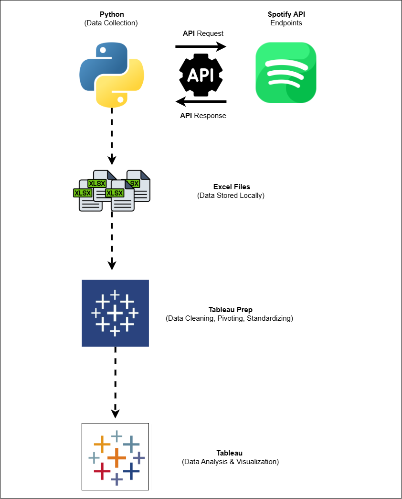
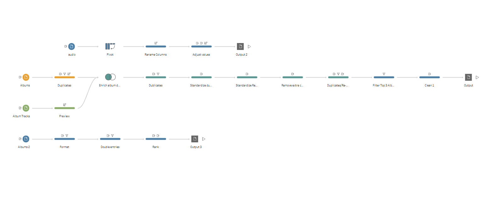

# NYC 90s-00s Hip-Hop Artists (Python + Spotify API, Tableau)

A **personal data project** exploring some of my favorite 90s and 2000s New York City hip-hop artists.  
This project **collects data using the Spotify Web API and Python** and includes a **Tableau dashboard** visualizing the artists’ music, albums, and top records.

---

## 📊 Data Collected

1. **Artist Info** – Followers, genres, Spotify URL, profile image  
2. **Albums** – Album name, release date, total tracks, album image, Spotify URL  
3. **Album Tracks** – Track name, duration, explicit flag, popularity, preview URL  

All data is saved in `/data` as Excel files.

---

## 🗂 Project Architecture

Overal project flow pipeline:

- Python scripts → Spotify API → Data collection  
- Data cleaning & transformation → Tableau Prep  
- Data visualization → Tableau dashboard → Tableau Public  

---

## 🛠 Data Preparation Flow (Tableau Prep)

The flow **standardizes data, removes inconsistencies and duplicates, merges tables to enrich the dataset, and pivots fields**, preparing the data for analysis and visualization.

---

## 📈 Tableau Public Dashboard

Below is a preview of the interactive dashboard visualizing NYC Hip-Hop data:

You can view and interact with the full dashboard here:  
[New York City Hip-Hop Legacy Dashboard](https://public.tableau.com/app/profile/aronas.zilys/viz/NewYorkCityHipHopLegacy/MainPage)

